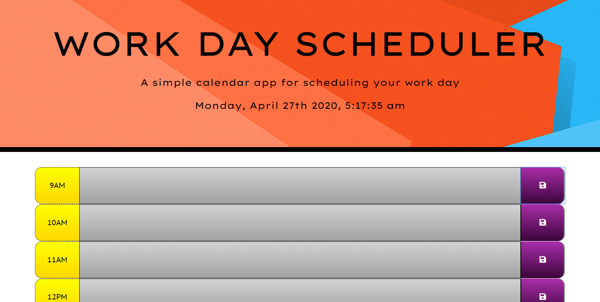
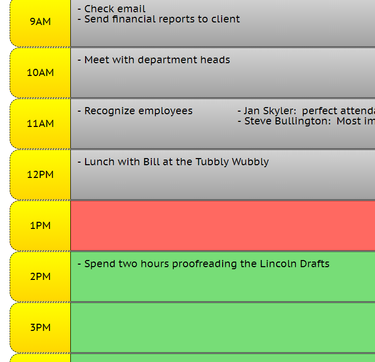

# Day Planner

Keep your tasks organized with this simple day planner.

**[Try it yourself!](https://jmantis0.github.io/daily-task-planner/)**

## Features

**Dynamic Appearance** 
This planner utilizes the moment.js API to dynamically detect the time of day and adjust the planner's appearance automatically, letting you know where you're at in your day.

**Persistent Data Storage**  
This planner also allows you to edit, save, or delete your tasks as you wish, and your data will persist and remain available even if you close or refresh your browser!

**It has a Digital Clock**
Time is money!

## Screenshots

