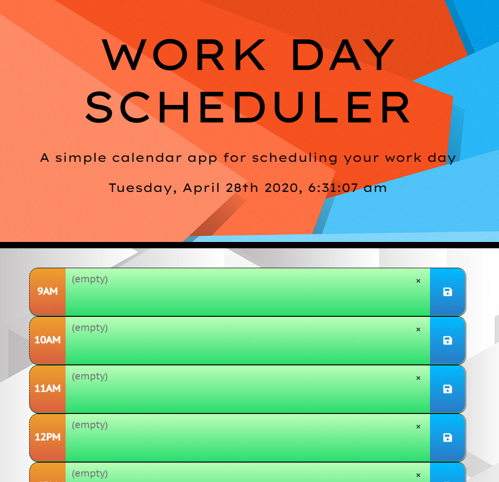

# Day Planner

## Keep your tasks organized with this simple day planner.

**[Try it yourself!](https://jmantis0.github.io/work-day-scheduler/)**

## Features

### Dynamic Appearance
This planner utilizes the moment.js API to dynamically detect the time of day and adjust the planner's appearance automatically, letting you know where you're at in your day.

### Persistent Data Storage
This planner also allows you to edit, save, or delete your tasks as you wish, and your data will persist and remain available even if you close or refresh your browser!

### Onboard Digital Clock
100% Accurate

### Responsive Design
Fully functionally on desktops and mobile devices.

##  Contributions

Once again thanks to [freesound.org](https://freesound.org/) for their free sound downloads.

Thanks to [Audacity](https://www.audacityteam.org/) for their free audio software.

Thanks to [Bootstrap CSS Framework](https://getbootstrap.com/) for their open source CSS library.

And thank you to [Vecteezy.com](https://www.vecteezy.com/) for the background art.
